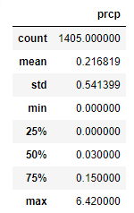
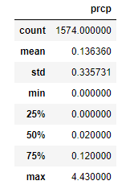
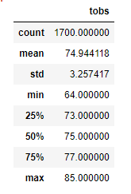
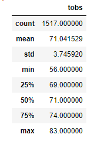

# Surfs_Up

### Overview of statistical analysis
  For this weeks module I worked along side W. Avy and pitched them a new idea for a surf shop. They are all for it and am excited to get started working with me. W. Avy has one concer before we get started planning the legistics and that is weather. W. Avy is concerned that the spot in Oahu we have picked out might get too much rain for anyone to enjoy surfing and ice cream! So in response to there concern I have tracked and collected all of the data for rainy weather in the past and similar seasons leading to the present to ease W. Avy's mind and continue on with our new venture. 
  
### Results
  - From our collected data(which will be pictured below) I found that the month of June has a very low average of rainfall and is a verey safe bet on good weather throughout. 
  - For December it seems like a farely similar pattern with slightly more rain but nothing to note of a concern because most of it is short bursts of rain and nothing to be concerned of. It does have more average rain than June but is not noticable. 
  -Last I would like to point out the temprature. The average temprature in both months are practically identical so there is nothing to worry about there. Both perfect months for some ice cream and surfing. 
  
  ### Rain fall in June and December 
  
  
  
  ### Temprature in June and December 
  
  
  
### Summary
  -In conlusion and to sum everything we have gathered up. We have compared the average rainfall in June and December. From that data shown above we have come to the conclusion that both months do see rain but the difference is very negligible so we can conclude that both months will have similar weather and will be good for both surfing and ice cream. 
  -Last to point to our data we collected first, being temprature between June and December. It is an almost identical situation to rainfall that we collected. Both months have a great median, mean and high temprature all being very bearable and will accomodate customers just fine.   
  
  
  
